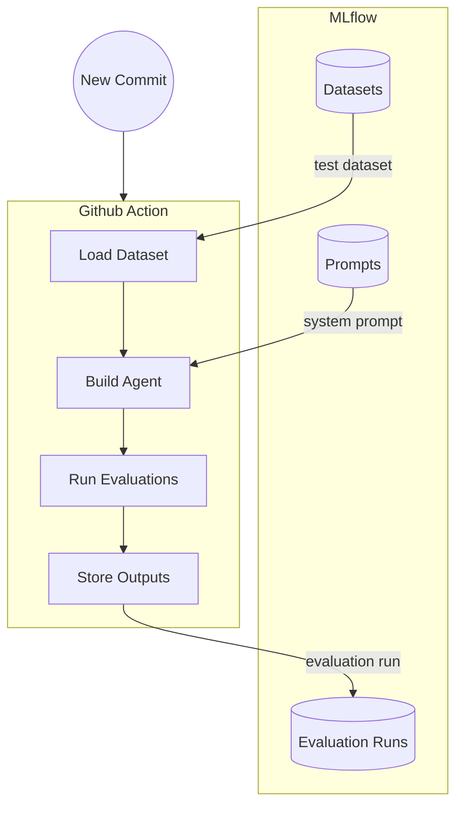
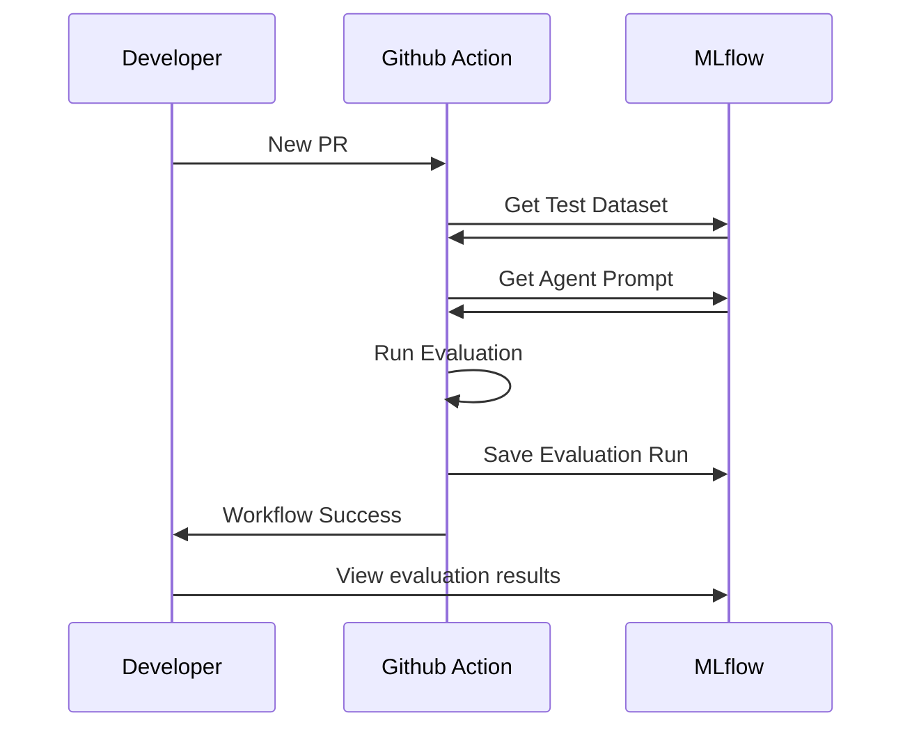

# GitHub Workflow

## Diagram

```mermaid
graph TB
    subgraph "MLflow"
        direction TB
        A[("Datasets")]
        B[("Prompts")]
        C[("Evaluation Runs")]
    end
    subgraph gh ["Github Action"]
        direction TB
        D["Load Dataset"]
        E["Build Agent"]
        F["Run Evaluations"]
        G["Store Outputs"]
        D --> E
        E --> F
        F --> G
    end
    A --test dataset--> D
    B --system prompt--> E
    G --evaluation run--> C
    H(("New Commit"))
    H --> gh
```

```mermaid
sequenceDiagram
    participant Developer
    participant Github Action
    participant MLflow
    Developer->>Github Action: New PR
    Github Action->>MLflow: Get Test Dataset
    MLflow->>Github Action: 
    Github Action->>MLflow: Get Agent Prompt
    MLflow->>Github Action: 
    Github Action->>Github Action: Run Evaluation
    Github Action->>MLflow: Save Evaluation Run
    Github Action->>Developer: Workflow Success
    Developer->>MLflow: View evaluation results
```